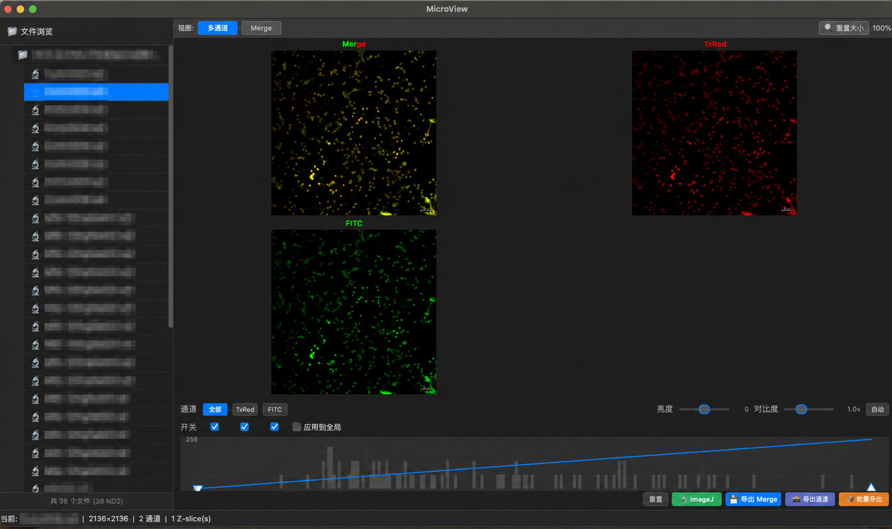
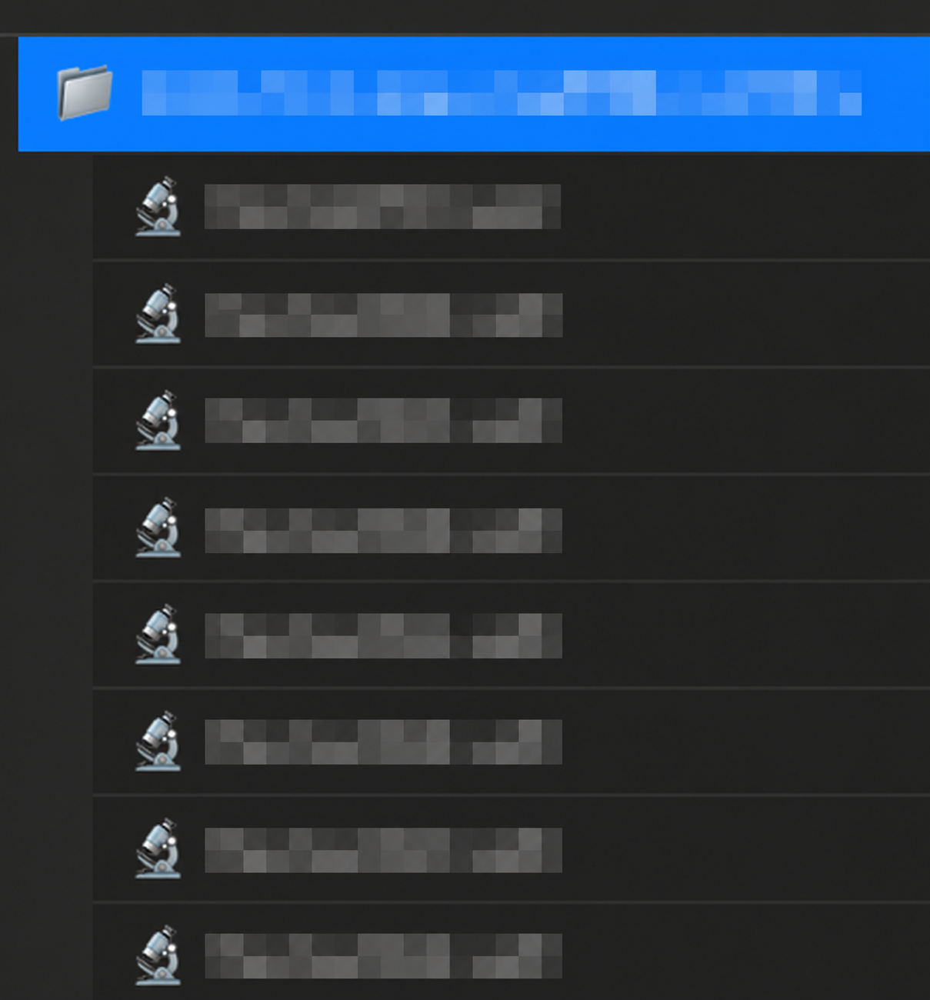
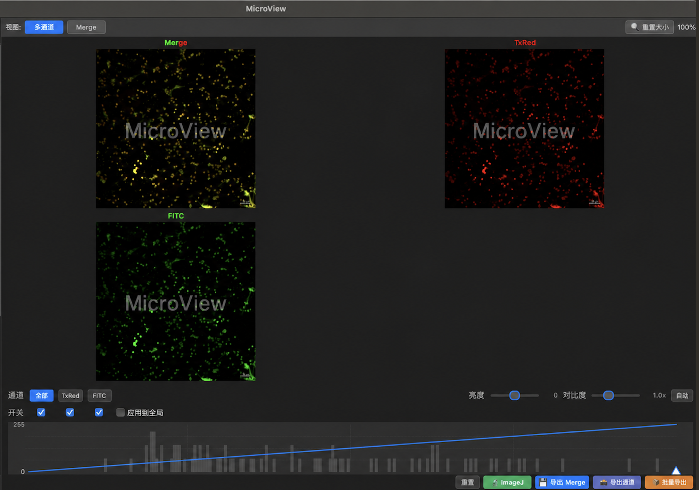
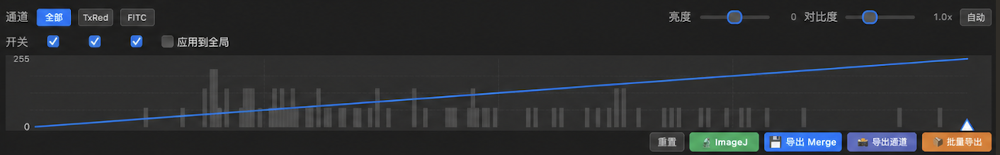
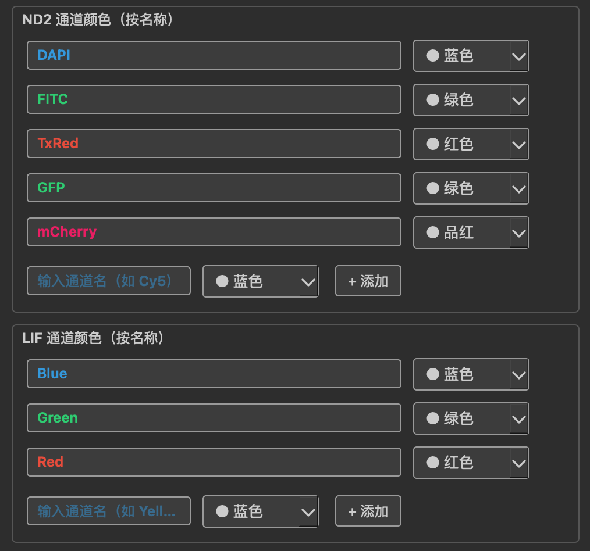
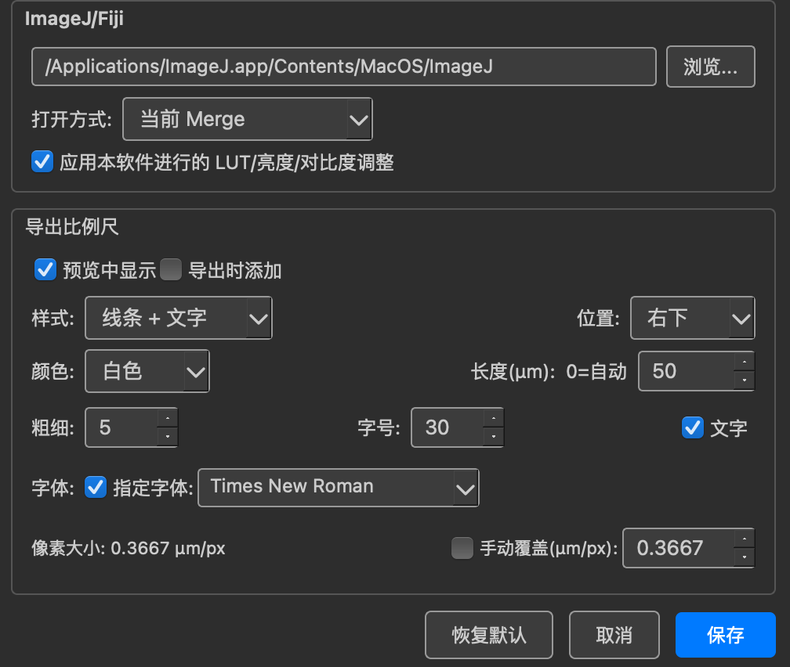
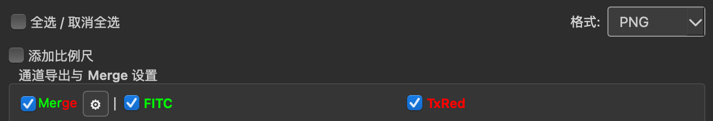

# MicroView

> **跨平台的 ND2 / LIF 显微图像浏览、校正与导出工具——同时支持 macOS 与 Windows。**

**在 Mac 上也能直接浏览 ND2。** Nikon 官方 ND2 软件缺少 macOS 版本；在 Windows 上同时打开大量图像和多通道窗口时，又容易出现卡顿，窗口还需要逐个整理和拖放。

MicroView 为 macOS 与 Windows 提供一致的单窗口工作流，把文件列表、Merge、单通道和显示控制集中在一起。即使连续查看同一次实验中的大量图片，也不必同时堆叠一批独立窗口。

MicroView 专注于把这段工作流变得顺手：**扫描文件夹 → 从侧边栏连续切换图像 → 同时查看 Merge 与单通道 → 调整显示 → 导出或交给 ImageJ/Fiji。**

它不是为了取代专业显微图像分析平台，而是为“快速看图、选图、统一显示和导出”提供更连贯的体验。

## 界面预览

<p align="center">
  
</p>

MicroView 把实验文件列表、Merge 与单通道预览、LUT 调整和导出入口集中在同一个工作区中。无需为每个通道反复打开、排列和拖动独立窗口，就能连续浏览整个实验文件夹。

## 功能亮点

### ND2 与 LIF 浏览

- 支持 Nikon `.nd2` 与 Leica `.lif`。
- 每个 LIF Series 都能作为独立图像浏览。
- 递归扫描文件夹，并用树状侧边栏管理实验数据。

<p align="center">
  
</p>

从文件夹层级直接切换图像或 Series，适合快速筛选同一次实验中的大量视野。

### 多通道预览与显示控制

- 同时显示 Merge 与各个单通道图像，支持同步缩放与平移。
- 可单独查看 Merge；调整显示参数时保留当前缩放和位置。
- 独立控制每个通道的开关、LUT 黑场/白场、亮度和对比度。
- 自动识别常见通道命名和 Leica LUTName：DAPI/Hoechst、GFP/FITC、RFP/mCherry、Blue、Green、Red 等。
- 支持自定义 ND2 与 LIF 通道颜色映射。

<p align="center">
  
</p>

Merge 与各单通道保持在统一布局中；缩放或平移时可以同步观察不同通道的空间对应关系。

<p align="center">
  
</p>

直方图和 LUT 控件集中在预览区下方，调整时不必离开当前图像。

<p align="center">
  
</p>

可按通道名称设置默认颜色，也可以添加实验中使用的自定义命名规则。

### 全局显示设置

默认情况下，每张图像或 LIF Series 都保留独立的显示配置。

启用“应用到全局”后，当前图片的通道开关、LUT 范围、亮度和对比度会在本次软件运行中应用到之后实际打开的图片或 Series。该功能采用惰性应用：不会预加载、遍历或刷新全部图片。

### 比例尺与导出

- 预览和导出图像均可添加比例尺。
- 可设置比例尺位置、长度、颜色、粗细、字体、字号和文字标签。
- 支持 PNG 与 TIFF；可导出 Merge、单独通道或两者组合。
- Merge 使用的通道可与单通道导出独立配置。
- 支持批量导出、通道筛选、统一显示参数和比例尺。

<p align="center">
  
</p>

比例尺样式、位置、长度和文字可以统一配置；同一设置页也可指定 ImageJ/Fiji 路径及打开方式。

<p align="center">
  
</p>

批量导出时可以分别决定是否导出单通道、Merge 使用哪些通道，以及最终文件格式。

### ImageJ / Fiji 集成

可从 MicroView 直接在 ImageJ/Fiji 中打开原始 ND2/LIF、当前 Merge、当前启用通道或组合结果。

> 打开原始 ND2/LIF 文件需要 Fiji/ImageJ 已安装 Bio-Formats。

## 安装

### macOS

1. 下载 `MicroView.app`，拖入“应用程序”文件夹。
2. 首次运行如出现安全提示，在“系统设置 → 隐私与安全性”中选择仍要打开。

### Windows

1. 下载并解压 `MicroView.zip`。
2. 运行 `MicroView.exe`。

## 快速开始

1. 打开包含 ND2 或 LIF 文件的文件夹。
2. 在左侧文件树选择图像或 LIF Series。
3. 在底部控制区调整通道开关、LUT、亮度和对比度。
4. 在预览区检查 Merge 与单通道效果。
5. 使用“导出 Merge”“导出通道”或“批量导出”生成结果。
6. 如需进一步分析，点击 ImageJ 按钮交给 Fiji/ImageJ。

## 构建

### macOS

```bash
pip install -r requirements.txt
pyinstaller build.spec
```

构建结果：`dist/MicroView.app`

### Windows

最简单的方式是在 Windows 上双击项目根目录的 `build.bat`。脚本会复用电脑上已有的 Python 3.12 和已安装依赖、补齐缺少的依赖、构建程序，并在成功后打开 `MicroView.exe` 所在文件夹。如果项目位于 Mac 共享目录，脚本会先将源码复制到 Windows 本机临时目录，避免 UNC 路径和共享盘权限问题。

也可以手动运行：

```bash
pip install -r requirements.txt
pyinstaller build-windows.spec
```

一键构建结果：`桌面/MicroView_Windows/MicroView.exe`

手动构建结果：`dist/MicroView/`

## 技术栈

Python · PySide6 · NumPy · nd2 · readlif · Pillow · PyInstaller

## 致谢

- [ImageJ](https://imagej.net/)
- [Fiji](https://fiji.sc/)
- [Bio-Formats](https://www.openmicroscopy.org/bio-formats/)
- [nd2](https://github.com/tlambert03/nd2)
